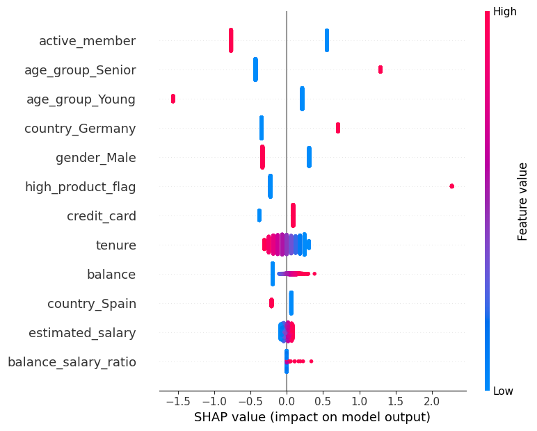

# Bank Customer Churn Prediction

An end-to-end churn prediction pipeline for a retail bank — from EDA and feature engineering through class-imbalance correction, multicollinearity checks, statistical feature selection, and an interpretable, threshold-tuned Logistic Regression model, explained with SHAP.

## Why this project

Acquiring a new customer costs far more than retaining an existing one. This project builds a model that flags at-risk customers *before* they leave, and — just as importantly — explains *why* each customer is at risk, so a retention team can act on the prediction rather than just trust it.

## Results

| Metric | Default threshold (0.5) | Recall-optimized (0.373) |
|---|---|---|
| Accuracy | 75.4% | 65% |
| Recall (churned) | 68% | 80% |
| Precision (churned) | 43% | 35% |
| ROC-AUC | 0.80 | 0.80 |

The default threshold gives a balanced model, but in a churn context, missing a real churner (lost revenue) is more costly than a false alarm (one retention offer). Lowering the decision threshold trades some precision for a meaningfully higher catch rate — a deliberate business call, not a fix for a weak model.

## Dataset

[Bank Customer Churn Dataset (Kaggle)](https://www.kaggle.com/datasets/gauravtopre/bank-customer-churn-dataset) — 10,000 customers, ~20% churn rate. Clean on arrival (no missing values or duplicates).

## Approach

- **EDA:** univariate and bivariate analysis surfaced the clearest early churn signals — inactive members churn at ~2x the rate of active ones, older customers churn far more than younger ones, and German customers show elevated churn versus France/Spain
- **Feature engineering:**
  - `age_group` — binned age into 4 segments after finding a non-linear relationship with churn (7.5% churn for young customers → 51.1% for Senior)
  - `balance_salary_ratio` — balance relative to salary, capturing financial engagement the raw features missed on their own
  - `high_product_flag` — customers holding 3+ products, which turned out to be one of the strongest and most counterintuitive signals in the dataset (85.9% churn vs. 18.2% for 1–2 products)
- **Class imbalance:** corrected with SMOTENC (handles mixed categorical/numeric features) on the training set only
- **Feature selection:** Mutual Information and Chi-Square filtering, with VIF checks to rule out multicollinearity before modeling
- **Model:** Logistic Regression, chosen for interpretability — each coefficient maps directly to churn probability. Regularization strength tuned via a C-sweep validation curve (C=11.29)
- **Validation:** 5-fold Stratified Cross-Validation (mean accuracy 75.70% ± 0.69%, mean ROC-AUC 0.8363 ± 0.45%) — low variance across folds and near-identical train/test scores indicated no overfitting
- **Explainability:** SHAP values applied to the final model to decompose predictions feature-by-feature, not just rank features by importance

## Key findings

- **Engagement dominates:** `active_member` is the single strongest churn driver — inactive customers are pushed sharply toward "will churn"
- **Age is non-linear:** risk climbs steeply into the Senior segment, then flattens — a straight-line "older = riskier" model would have missed this
- **More products ≠ more loyalty:** customers with 3+ products churn dramatically more, the opposite of what "product cross-sell" intuition would suggest
- **Geography matters:** German customers show elevated risk relative to France and Spain

## A caveat I flagged myself

`active_member`'s influence is nearly 2x the next-strongest feature — worth scrutinizing. If that field reflects a customer's status *at or after* they churned, rather than a genuine leading indicator, its dominance could be target leakage rather than real predictive signal. I'd verify this against the data's timing before trusting this model for production decisions — noting it here rather than presenting the result as clean.

## Future work

- Confirm the timing/definition of `active_member` to rule out leakage
- Try tree-based models (Random Forest, XGBoost) as a benchmark against Logistic Regression's linear assumptions
- Test the model's stability on a more recent or geographically broader dataset

## Tech

Python · pandas · scikit-learn · imbalanced-learn (SMOTENC) · SHAP · matplotlib · seaborn

